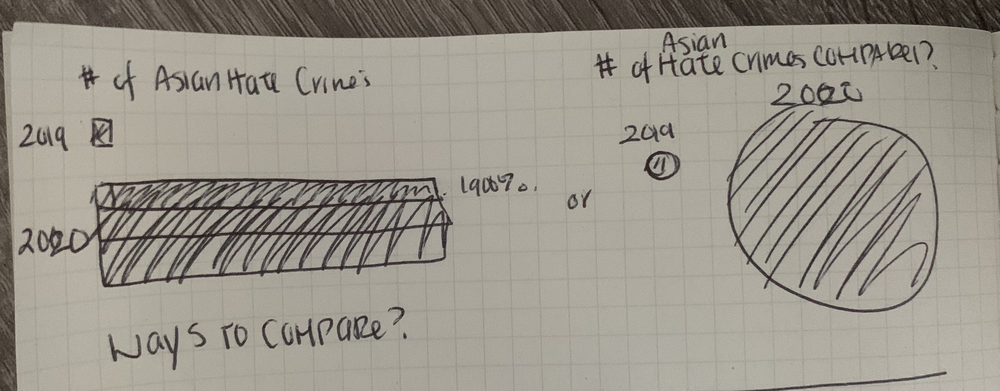
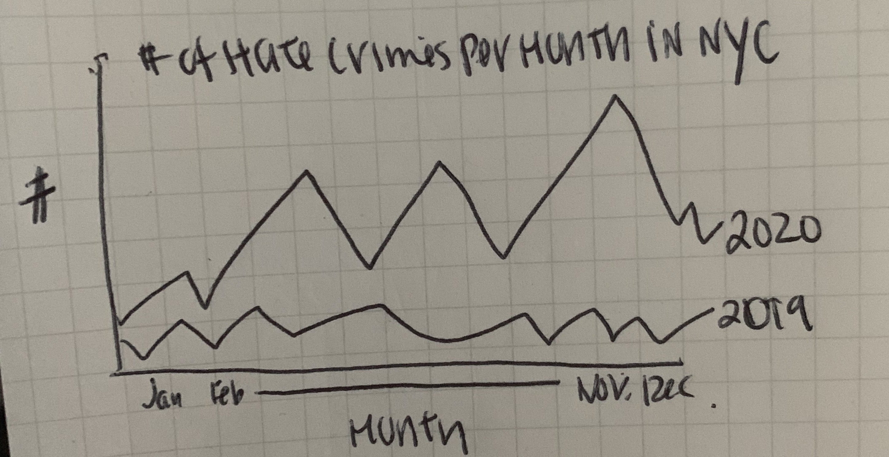
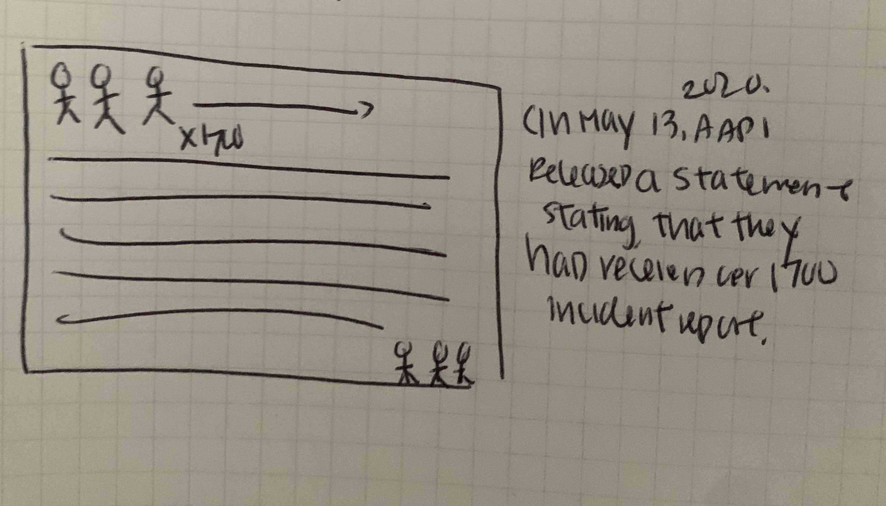

# The Rise of Hate Crimes Against Asian Americans

# Story
Hate crimes against Asian Americans are rapidly growing since the start of the COVID pandemic. 
As a reader, I want to know why they are rising so that I raise awareness on this topic and provide support to Asian commmunities.
My call to action is to provide resources to help these communities and raise awareness over thes situations.

# Why this subject? What do I want to tell?
Since the beginning of COVID, hate crimes against Asian Americans have gone up tremendously and there has been little media coverage over this. Much of the news regarding this subject was first reported through popular media websites such as NextShark. Only a few significant stories involving death or extremely injured victims were receiving more coverage on media such as WSJ and NY Times. Much of these attacks are due to the rise of xenophobia and racism against Asians after the start of the COVID pandemic. With a former president and other politicians calling the virus, the Chinese Flu or the Wuhan Virus, 
this language had spread to general public and created a stigma against Asian Americans. This was also added to by popular news outlets like NY Times who would use photos of Chinatown and Asian Americans as a header images when speaking about COVID, creating associations that were unnecessary.

With these events, it created a sense of fear among Asian communities as agressive and violent behavior increased over the last year. Many of the attacks are directed to people who lack the power to fight back physically such as elderly and children. 
It's heartbreaking to see this uncovered by the media and I would share some of these stories outlets there is a lack of representation of Asians in the media.

I also want to provide resources to learn more and help out. Because this is not getting covered in media as often as it should, it's hard to find data on this  subject and places that people can go to for support. There are groups such as the NYPD Asian Hate Crime Task Force or local Chinatown communities that are helping out by offering walks, protection and funds to those who need it.

I will be using Shorthand (for now) to develop my website and tell this story. I also will be trying to take my own photos for this project.

# Data/Reports to Work with
American Bar Report of NY;
https://cdn.ymaws.com/www.aabany.org/resource/resmgr/press_releases/2021/A_Rising_Tide_of_Hate_and_Vi.pdf

UN Report;
https://spcommreports.ohchr.org/TMResultsBase/DownLoadPublicCommunicationFile?gId=25476

NYPD 2020 Hate Crime Reports:
https://www1.nyc.gov/site/nypd/stats/reports-analysis/hate-crimes.page

Number of Reports AAPI has received & More Reports:
http://www.asianpacificpolicyandplanningcouncil.org/wp-content/uploads/Press_Release_5_13_20.pdf
https://stopaapihate.org/reportsreleases/

With the data sets, I hope to use most of them to compare the rise in hate crimes from the last year. However, I will be starting off with how Asian hate crimes have risen 1900% would drive in the story, because this is the most striking information.

From the American Bar Report and UN Report, there is also information of what kind of violent crimes are occuring such as physical alteractions, name calling, shaming, and more. I would most likely use a circle graph here to display the variety of crimes that are happening.

Majority of my data will becoming from Stop AAPI Hate, an organization dedicated to spreading news on this subject and collecting reports on this subject. Some of their reports are in specific areas like LA or Georgia, so I might try to use a comparison of locations that these crimes are happening in. 

Below are some sketches I will be creating visualizations for.

I think I'll start with this graph first to show the increase of crimes in comparison from 2019 to 2020. 
1900% is an increase that's pretty incomprehensible, so I think a comparison would would be start the story strong.

I would also show a line graph comparison to show how the crimes rose in a span of a few months in 2020 as compared to 2019. The start of COVID in the US started in March and you should be to see the continued rise of crimes. While this displays only shows NY data, I would also show other places such as Georgia and LA as well.

There are all types of crimes happening. While only a few of the stories are being shared online, they are mostly violent. I also want to include those like name-calling and online threats that are happening. 

I think showing the number of crimes would be significant in comparison to 1 crime. I'm thinking of creating a visualization of 1700 human figures would show the sheer numbers of crimes.

# How to Tell the Story
The way I want to tell my story is first through the large quanities of numbers. I think this is the most shocking. By first show the data like Berinato recommended, it should be a good way to start the story and continue onto why this is happening. From there, describing some potential causes like the lack of attention in media and the xenophobia spread of politicians and other new sources, I think I can also give some history on Asian communieties as well to give more emotion to the story. (Maybe by mentioning what percentage of the population they make up). Finally to end, I want to include resources to help this cause like as AAPI.

Articles for New Stories and Storytelling
https://www.usatoday.com/story/news/nation/2021/02/12/asian-hate-incidents-covid-19-lunar-new-year/4447037001/
https://www.nytimes.com/2021/02/12/us/asian-american-racism.html
https://www.nbcnewyork.com/news/local/crime-and-courts/study-shows-rise-of-hate-crimes-violence-against-asian-americans-in-nyc-during-covid/2883215/
https://cdn.ymaws.com/www.aabany.org/resource/resmgr/press_releases/2021/A_Rising_Tide_of_Hate_and_Vi.pdf
https://www.wsj.com/articles/new-york-city-police-mobilize-against-rise-in-hate-crimes-targeting-asians-11614118602
https://www.thecut.com/2021/02/the-us-is-seeing-a-massive-spike-in-anti-asian-hate-crimes.html

Articles for Background Info (Racism in US, Why calling it the Chinese Flu is Harmful)
https://medicine.yale.edu/news-article/23074/
https://www.psychologytoday.com/us/blog/the-pacific-heart/202003/calling-covid-19-chinese-virus-or-kung-flu-is-racist
https://www.npr.org/2020/03/02/811363404/when-xenophobia-spreads-like-a-virus

